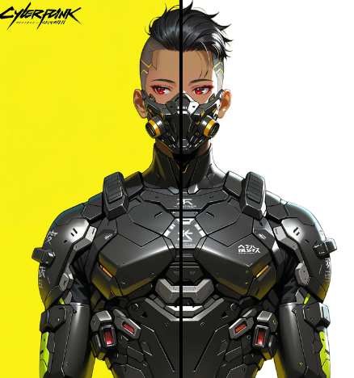

# AI-Background-Remover-Inpaint-Editor

[](https://www.python.org/downloads/)
[](https://opensource.org/licenses/MIT)
[](https://gradio.app/)

A powerful Python application that combines AI-powered background removal with manual inpainting tools, providing a user-friendly web interface built with Gradio. Perfect for photographers, designers, and anyone needing quick and professional image editing capabilities.



## Features

- 🎯 AI-powered background removal
- 🖌️ Manual inpainting tools for fine-tuning
- 🌐 User-friendly web interface
- 🚀 Real-time processing
- 💾 Support for multiple image formats
- 🔧 Multiple AI models to choose from

## Installation

# EASY INSTALL

```bash
git clone https://github.com/RedsAnalysis/AI-Background-Remover-Inpaint-Editor.git
cd AI-Background-Remover-Inpaint-Editor
./setup.sh
source venv/bin/activate
python app.py
```

# MANUAL INSTALL
1. Clone the repository:
```bash
git clone https://github.com/RedsAnalysis/AI-Background-Remover-Inpaint-Editor.git
cd AI-Background-Remover-Inpaint-Editor
```

2. Set up a virtual environment (strongly recommended):
```bash
# On Windows
python -m venv venv
venv\Scripts\activate

# On macOS/Linux
python -m venv venv
source venv/bin/activate

# Verify you're in the virtual environment (should show venv path)
where python  # on Windows
which python  # on macOS/Linux
```

3. Install dependencies in the virtual environment:
```bash
# Upgrade pip first (recommended)
python -m pip install --upgrade pip

# Install project dependencies
pip install -r requirements.txt
```

Note: Always make sure your virtual environment is activated when working with the project. You'll know it's activated when you see `(venv)` at the beginning of your terminal prompt.

## Usage

1. Start the application:
```bash
python app.py
```

2. Open your web browser and navigate to the provided local URL (typically http://localhost:7860)

3. Upload an image using the web interface

4. Use the background removal tool to automatically remove the background

5. Fine-tune the results using the inpainting tools if needed

6. Download your processed image

## Prerequisites

- Python 3.8 or higher
- pip (Python package installer)
- Git
- 4GB+ RAM recommended for optimal performance
- CUDA-compatible GPU (optional, for faster processing)

## Development Setup

1. Ensure you have Python 3.8+ installed:
```bash
python --version
```

2. Set up a virtual environment (recommended):
```bash
# On Windows
python -m venv venv
venv\Scripts\activate

# On macOS/Linux
python -m venv venv
source venv/bin/activate
```

3. Install dependencies:
```bash
pip install -r requirements.txt
```

## Requirements

See requirements.txt for detailed package dependencies. Key dependencies include:
- rembg & transparent_background: For background removal
- gradio: For the web interface
- Pillow: For image processing
- torch & onnxruntime: For AI model operations

## Contributing

Contributions are welcome! Please feel free to submit a Pull Request.

1. Fork the repository
2. Create your feature branch (`git checkout -b feature/AmazingFeature`)
3. Commit your changes (`git commit -m 'Add some AmazingFeature'`)
4. Push to the branch (`git push origin feature/AmazingFeature`)
5. Open a Pull Request

## License

This project is licensed under the MIT License - see the LICENSE file for details.

## Troubleshooting

### Common Issues

1. **Installation Errors**
   - Ensure you're using Python 3.8 or higher
   - Try upgrading pip: `pip install --upgrade pip`
   - If you encounter CUDA errors, make sure your GPU drivers are up to date
   - If you see "command not found" errors, ensure your virtual environment is activated
   - If pip install fails, try creating a fresh virtual environment
   - For Windows users: if `venv\Scripts\activate` fails, try using `venv\Scripts\Activate.ps1` in PowerShell

2. **Runtime Errors**
   - Check if all dependencies are properly installed
   - Verify you have sufficient RAM available
   - Ensure the virtual environment is activated (if using one)

3. **Performance Issues**
   - Consider using a GPU for faster processing
   - Close other resource-intensive applications
   - Try processing smaller images first

## Acknowledgments

- [rembg](https://github.com/danielgatis/rembg) for background removal
- [Gradio](https://gradio.app/) for the web interface framework
- All contributors who have helped improve this project
